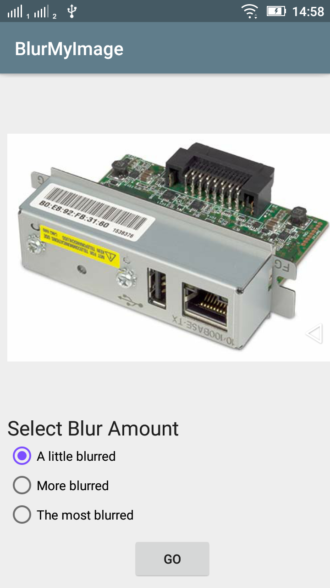
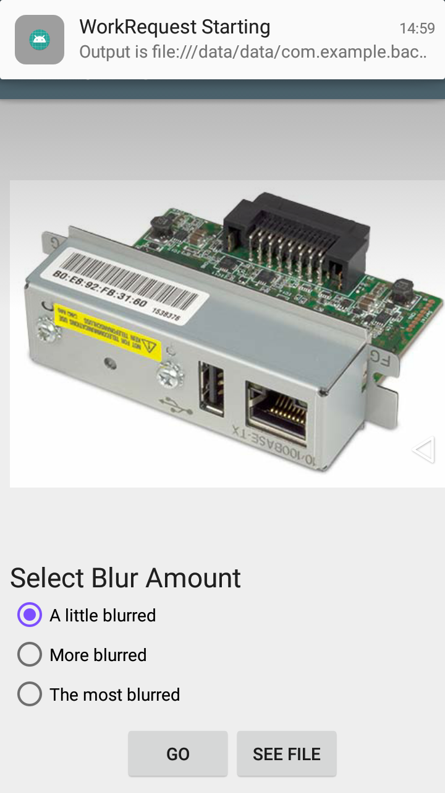

# AndroidWorkManager
Example of background work for blurring image in android using WorkManager.

## What is WorkManager ?
WorkManager is part of Android Jetpack and an Architecture Component for background work that needs a combination of opportunistic and guaranteed execution. Opportunistic execution means that WorkManager will do your background work as soon as it can. Guaranteed execution means that WorkManager will take care of the logic to start your work under a variety of situations, even if you navigate away from your app.

https://codelabs.developers.google.com/codelabs/android-workmanager/

## App Screenshots
   