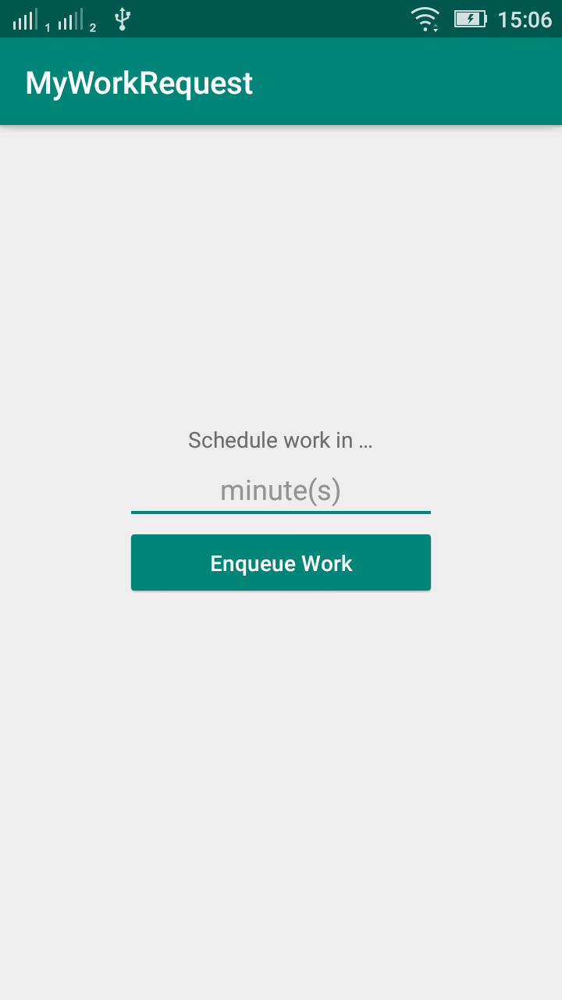
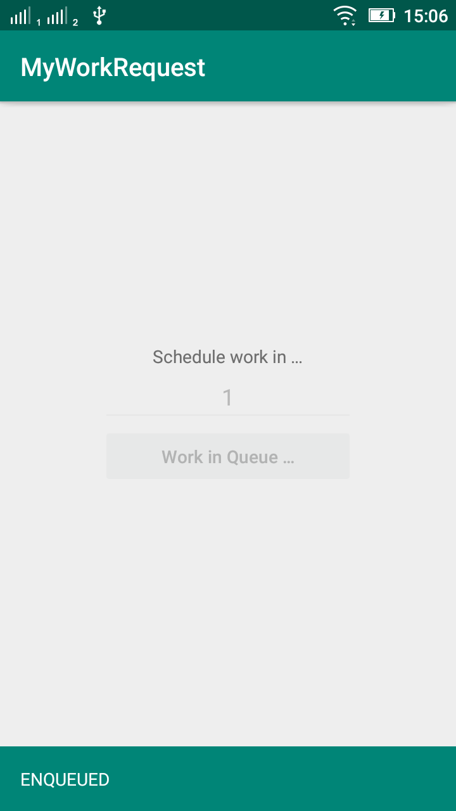
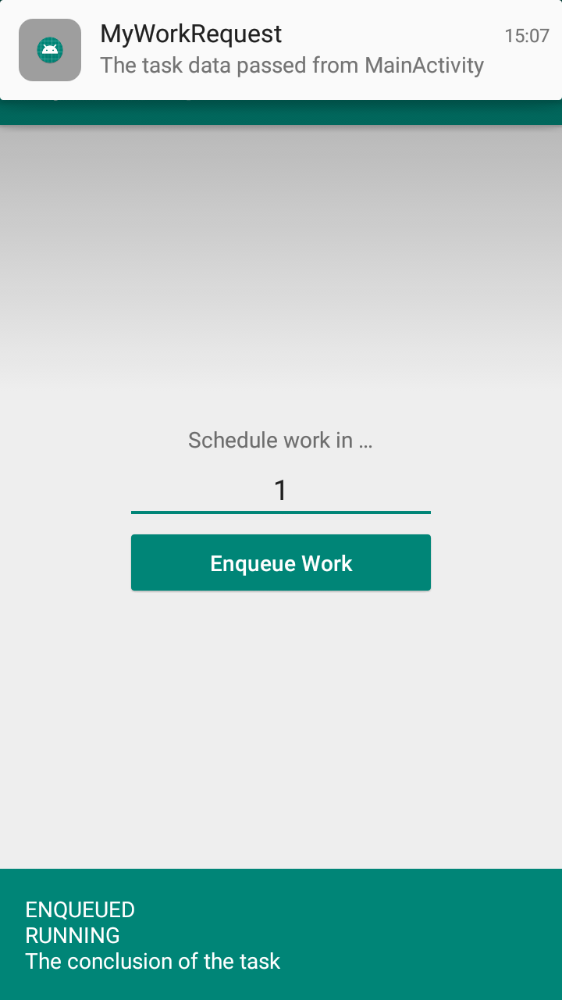

# MyWorkRequest
Example of OneTimeWorkRequest with scheduler and PeriodicWorkRequest using android WorkManager.

https://developer.android.com/reference/androidx/work/OneTimeWorkRequest 
https://developer.android.com/reference/androidx/work/PeriodicWorkRequest 
https://www.simplifiedcoding.net/android-workmanager-tutorial/

## App Screenshots
  