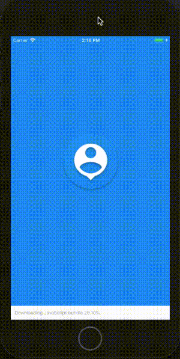

# RandomUser
Example of randomuser.me API implementation in react native with firebase real time database and firebase cloud messaging (only work in android physical device), created using Expo.  
Icons made by <a href="https://www.flaticon.com/authors/smashicons" title="Smashicons">Smashicons</a> from <a href="https://www.flaticon.com/" title="Flaticon">www.flaticon.com</a> is licensed by <a href="http://creativecommons.org/licenses/by/3.0/" title="Creative Commons BY 3.0" target="_blank">CC 3.0 BY</a>

## App Screenshots
 